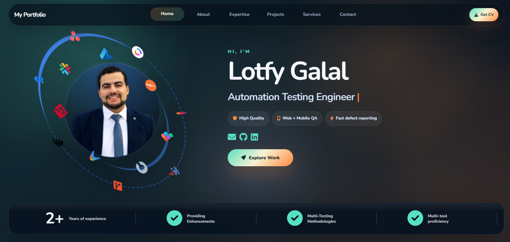

<h1 align="center">💼 Lotfy Galal - Software Testing Portfolio</h1>

  Personal portfolio showcasing my work, skills, and experience as a <b>Software Testing Engineer</b>.

  🌐 <a href="https://lotfygalal.github.io" target="_blank"><b>MY Portfolio WEB</b></a>

<!-- Badges -->

  
  
  
  
  
  
  
  
  

---

## 📸 Preview

  

---
## 📂 Sections
- **Home** – Intro and role.
- **About Me** – Brief personal and professional background.
- **Skills** – Technical skills and tools.
- **Projects** – Testing projects with demos.
- **Contact** – Links to connect.

---

## 🌟 Features
- Dark Theme Design - Sleek and modern dark interface  
- Responsive Layout - Works perfectly on all devices  
- Interactive Navigation - Smooth sidebar navigation with active states  
- Typewriter Effect - Animated text in hero section  
- Animated Counters - Dynamic statistics display  
- Particle Background - Floating particles animation  
- Smooth Scrolling - Seamless page navigation  
- Contact Form - Functional contact form with validation  
- Loading Animation - Professional loading screen  
- Scroll-to-top Button  
- Sliders and Modals for interactive content  

---
## 💻 Responsive Design
The portfolio is fully responsive and optimized for:  
- 📱 Mobile devices  
- 📱 Tablets  
- 💻 Desktops  
- 🖥 Large screens

---
## 🛠 Technologies Used
- HTML5 - Semantic markup  
- CSS3 - Modern styling with Grid and Flexbox  
- JavaScript - Interactive functionality  
- Font Awesome - Icons  
- Google Fonts - Typography    
---
## 📂 Project Structure

- portfolio/
- │
- ├── index.html                              # Main HTML file
- ├── css/
- │ └── style.css                             # Styles
- ├── js/
- │ └── script.js                             # JavaScript functionality
- ├── assets/
- │ └── profile.jpg                           # all picture used 
- └── README.md                               # Project documentation

---
## 🚀 Deployment
**GitHub Pages** 
- Fork this repository
- Go to Settings > Pages
- Select source branch (main)
- Your site will be available at https://lotfygalal.github.io/
---
## Netlify
- Connect your GitHub repository
- Deploy with default settings
- Your site will be available at your Netlify URL
---
## Vercel
- Import your GitHub repository
- Deploy with default settings
- Your site will be available at your Vercel URL
---
## 📱 Mobile Navigation
The portfolio features a responsive mobile navigation:
  - Hamburger menu for mobile devices
  - Smooth slide-in sidebar
  - Touch-friendly navigation links

## ⚡ Performance Features
Optimized Images - Compressed and properly sized
  - Smooth Animations - Hardware-accelerated CSS animations
  - Fast Loading - Minimal dependencies
  - SEO Friendly - Semantic HTML structure

## 🎯 Browser Compatibility
✅ Chrome (latest)

✅ Firefox (latest)

✅ Safari (latest)

✅ Edge (latest)

✅ Mobile browsers

---
## 👨‍💻 Author
**Lotfy Galal**

GitHub: [@lotfygalal](https://github.com/lotfygalal)

LinkedIn: [@lotfygalal](http://www.linkedin.com/in/lotfy-galal-b8136015a)

Email: lotfy.galal2@gmail.com

---
## ⭐ Star this repository if you find it helpful!
